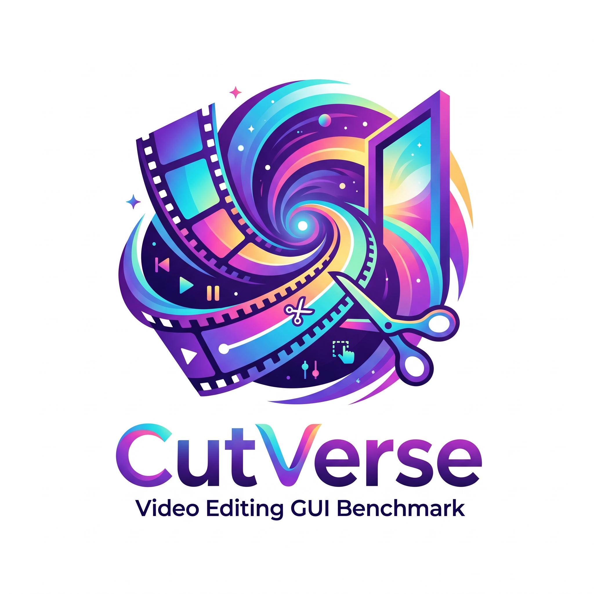
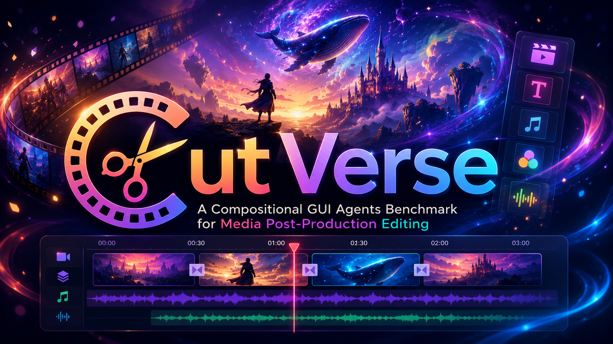
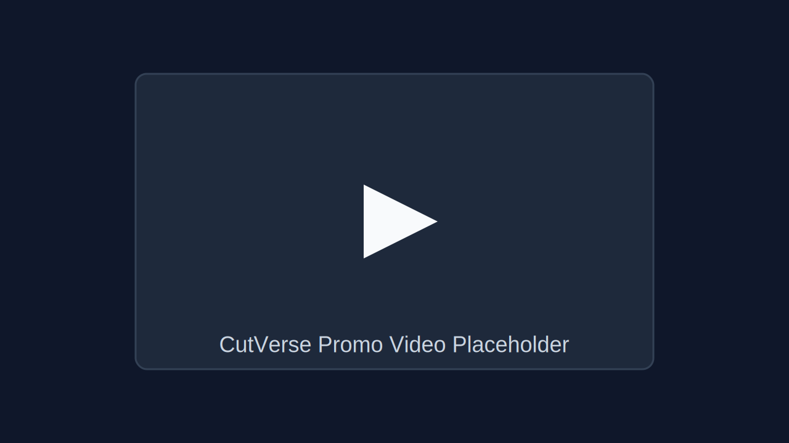

<table align="center">
  <tr>
    <td>
      
    </td>
    <td>
      <h1>CutVerse</h1>
    </td>
  </tr>
</table>

<p align="center">
  <a href="https://github.com/CUC-MIPG/CutVerse">Project Page</a> •
  <a href="PROJECT_BRIEF.md">Project Brief</a> •
  <a href="ROADMAP.md">Roadmap</a> •
  <a href="#promo-video">Promo Video</a>
</p>

**TL;DR:** CutVerse is a compositional GUI-agent benchmark for media post-production editing, targeting long-horizon, cross-application, multimodal workflows in real professional software.

<p align="center">
  
</p>

## Updates
- 2026-05-09: Upgraded repository homepage to a promotion-ready layout with reserved promo video section.
- 2026-05-08: Repository homepage aligned with paper scope and benchmark statistics.
- 2026-04-24: Public intro repository initialized.

## Why CutVerse

CutVerse benchmarks what current GUI-agent evaluations often miss: dense creative interfaces, strict temporal synchronization, and cross-modal alignment under long trajectories.

- Real software environments instead of synthetic task abstractions.
- End-to-end workflows from asset preparation to export.
- Milestone-driven trajectory verification beyond binary pass/fail.
- Scalable Windows-VM infrastructure for reproducible online evaluation.

## Task Coverage

CutVerse covers end-to-end media post-production tasks, including:

- Effects and visual tuning
- Export and delivery
- Asset import and management
- Audio and rhythm editing
- Timeline editing and arrangement
- Preview, check, and validation
- Masking, matting, and tracking
- Launch and setup
- Generative workflow

## Software Coverage

CutVerse currently involves professional workflows across:

- Adobe Premiere Pro
- Adobe After Effects
- Adobe Photoshop
- DaVinci Resolve
- JianYing
- ComfyUI
- Keling

## Infrastructure

CutVerse is built as a robust and scalable benchmark stack:

1. Windows VM execution engine with resettable checkpoints.
2. Parser that synchronizes screen recordings and low-level interaction logs.
3. Milestone QA evaluator for fine-grained online trajectory assessment.

Human-alignment study (300 trajectories reported in paper):

- GPT-5.4 evaluator agreement: 98.3%
- Claude-4.6 evaluator agreement: 99.0%

## Promo Video

> Reserved section for official CutVerse promotion video.

Option A (local file in repo):

```html
<video controls width="100%" poster="docs/assets/cutverse-promo-placeholder.svg">
  <source src="docs/assets/cutverse-promo.mp4" type="video/mp4">
</video>
```

Option B (external video link):

```markdown
[Watch CutVerse Promo Video](https://your-video-link)
```

Current placeholder thumbnail:

<p align="center">
  
</p>

## Repository Status

This repository is currently a public-facing homepage.

- Included now: project overview, benchmark scope, release roadmap.
- Planned next: protocol docs, baseline reports, evaluator toolkit, subset release.

## Citation

```bibtex
@article{hu2026cutverse,
  title={CutVerse: A Compositional GUI Agents Benchmark for Media Post-Production Editing},
  author={Hu, Haobo and Guo, Xiangwu and Chen, Zhiheng and Gao, Difei and Liu, Haotian and Jin, Libiao and Mao, Qi},
  journal={arXiv preprint},
  year={2026}
}
```

## Contact

For collaboration or early benchmark access, please open an issue in this repository.
