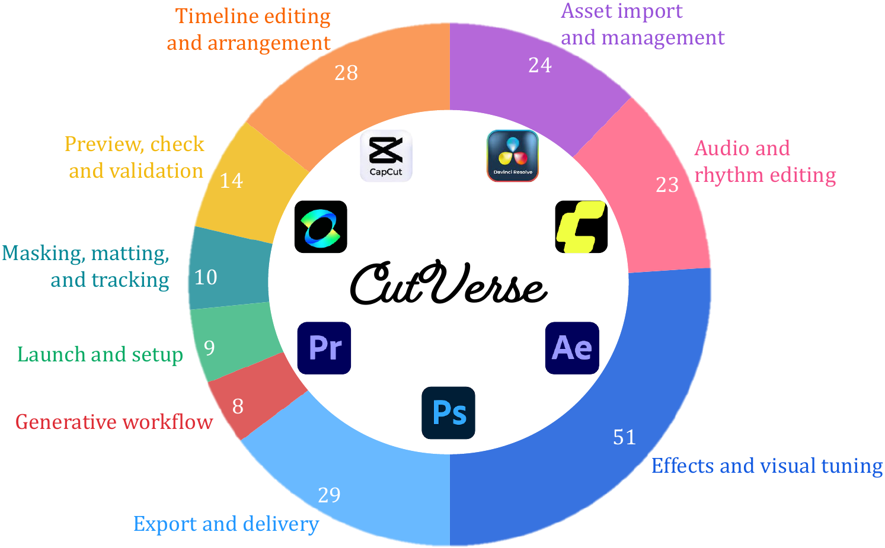
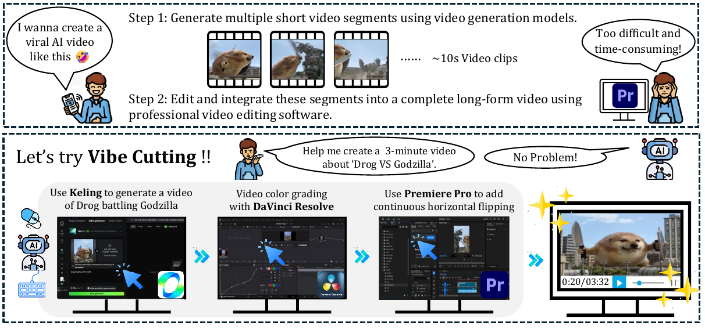
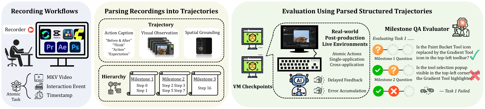

<h1 align="center">
  
  <i>CutVerse: A Compositional GUI Agents Benchmark for Media Post-Production Editing</i>
</h1>

<p align="center">
  <a href="https://github.com/CUC-MIPG/CutVerse">Project Page</a> •
  <a href="PROJECT_BRIEF.md">Project Brief</a> •
  <a href="ROADMAP.md">Roadmap</a>
</p>

**TL;DR:** CutVerse is a compositional GUI-agent benchmark for media post-production editing, targeting long-horizon, cross-application, multimodal workflows in real professional software.

<p align="center">
  
</p>

## Updates
- 2026-05-09: Upgraded repository homepage to feature the paper figures and a promotion-ready layout.
- 2026-05-08: Repository homepage aligned with paper scope and benchmark statistics.
- 2026-04-24: Public intro repository initialized.

## Why CutVerse

CutVerse benchmarks what current GUI-agent evaluations often miss: dense creative interfaces, strict temporal synchronization, and cross-modal alignment under long trajectories.

- Real software environments instead of synthetic task abstractions.
- End-to-end workflows from asset preparation to export.
- Milestone-driven trajectory verification beyond binary pass/fail.
- Scalable Windows-VM infrastructure for reproducible online evaluation.

## Task and Software Coverage

<p align="center">
  
</p>

## Infrastructure

CutVerse is built as a robust and scalable benchmark stack:

1. Windows VM execution engine with resettable checkpoints.
2. Parser that synchronizes screen recordings and low-level interaction logs.
3. Milestone QA evaluator for fine-grained online trajectory assessment.


**CutVerse overview**

<p align="center">
  
</p>

**Data and evaluation pipeline**

<p align="center">
  
</p>

## Repository Status

This repository is currently a public-facing homepage.

- Included now: project overview, benchmark scope, release roadmap.
- Planned next: protocol docs, baseline reports, evaluator toolkit, subset release.

## Citation

```bibtex
@article{hu2026cutverse,
  title={CutVerse: A Compositional GUI Agents Benchmark for Media Post-Production Editing},
  author={Hu, Haobo and Guo, Xiangwu and Chen, Zhiheng and Gao, Difei and Liu, Haotian and Jin, Libiao and Mao, Qi},
  journal={arXiv preprint},
  year={2026}
}
```

## Contact

For collaboration or early benchmark access, please open an issue in this repository.
